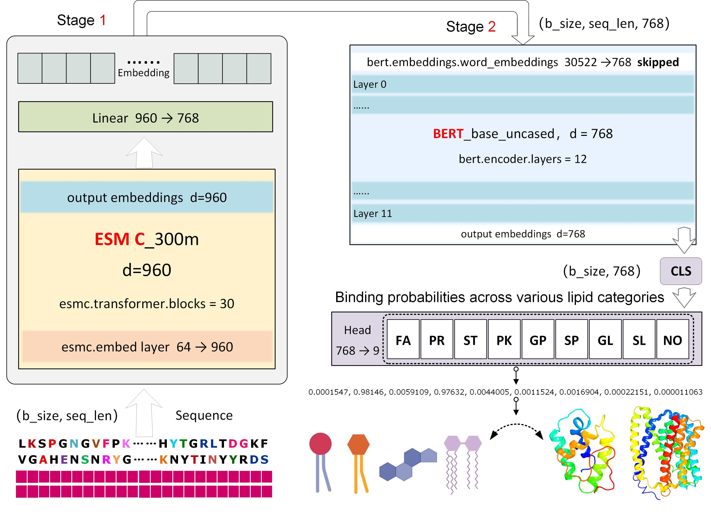

|   | <h1>PLiCat <br/> (Protein–Lipid interaction Categorization tool) </h1> |
|:------------------------------------------:|:-----------------------------------------------------------------------|


## Table of Contents
- [Introduction](#introduction)
- [OnlineResources](#onlineresources)
- [Usage](#usage)
- [Installation](#installation)
- [Citation](#citation)
- [License](#license)


## Introduction

- 🔬 a hybrid framework integrating ESM Cambrian (ESM Team, 2024) and BERT (Devlin et al., 2018) for multi-label classification.
- 🎯 Supports dynamic padding for efficient batch processing.
- 📊 Provides attribution heatmaps and embedding heatmaps for model interpretability and so on.

We developed a multi-label classification model named <b>PLiCat </b>(<b>P</b>rotein–<b>L</b>ipid <b>i</b>nteraction <b>Cat</b>egorization tool),that predicts protein-lipid binding abilities based on amino acid sequences. This model utilizes a hybrid framework integrating ESM Cambrian (ESM Team, 2024) and BERT (Devlin et al., 2018).  We also carefully developed training datasets and disease mutation datasets for model training and validation. 

**Overall schematic framework of PLiCat**:




## OnlineResources
---
- 📄 **Paper**: [https://...](https://....)  
- 🤗 **HuggingFace Repository**: [https://huggingface.co/Noora68/PLiCat-0.4B](https://huggingface.co/Noora68/PLiCat-0.4B)  
- 🚀 **Online Demo**: [https://colab.research.google.com/drive/1wGSZsy7KyYoJf2PiXzP4SVLXonl-cWb9?usp=sharing](https://colab.research.google.com/drive/1wGSZsy7KyYoJf2PiXzP4SVLXonl-cWb9?usp=sharing)  
- 📂 **Datasets**: [https://huggingface.co/datasets/Noora68/PLiCat-0.1.0](https://huggingface.co/datasets/Noora68/PLiCat-0.1.0)  
---

## Usage

**install the latest version**：

```python
pip install plicat_model

````
---

```python
from plicat_model import PLiCat
import torch
from torch.nn.utils.rnn import pad_sequence
from esm.tokenization import EsmSequenceTokenizer

# Set device (GPU if available, otherwise CPU)
device = torch.device("cuda" if torch.cuda.is_available() else "cpu")
tokenizer = EsmSequenceTokenizer()

# Default lipid type dictionary
default_dict = {
    "0": "NotLipidType",
    "1": "Fatty Acyl (FA)",
    "2": "Prenol Lipid (PR)",
    "3": "Glycerophospholipid (GP)",
    "4": "Sterol Lipid (ST)",
    "5": "Polyketide (PK)",
    "6": "Glycerolipid (GL)",
    "7": "Sphingolipid (SP)",
    "8": "Saccharolipid (SL)"
}

# Load pretrained PLiCat model
model = PLiCat.from_pretrained("Noora68/PLiCat-0.4B").to(device)

# Example protein sequence
sequence = "MDSNFLKYLSTAPVLFTVWLSFTASFIIEANRFFPDMLYFPM"

# Tokenize the sequence -> input_ids
input_ids = torch.tensor(tokenizer.encode(sequence))

# Add batch dimension: (batch_size=1, length)
input_ids = input_ids.unsqueeze(0)

# Pad to the longest sequence in the batch
input_ids_padded = pad_sequence(input_ids, batch_first=True, padding_value=tokenizer.pad_token_id)

# Build attention mask: 1 for real tokens, 0 for padding
attention_mask = (input_ids_padded != tokenizer.pad_token_id).long()

# Move tensors to the same device as model
input_ids_padded = input_ids_padded.to(device)
attention_mask = attention_mask.to(device)

# Forward pass (no gradient needed during inference)
with torch.no_grad():
    outputs = model(input_ids_padded, attention_mask)

# Convert logits to probabilities using sigmoid
probs = torch.sigmoid(outputs['logits'])

# Convert to CPU and numpy array
probs = probs.squeeze().detach().cpu().numpy()

# Print results: add a check mark if probability > 0.6
for i, p in enumerate(probs):
    mark = " √" if p > 0.6 else ""
    print(f"{default_dict[str(i)]:<25}: {p:.4f}{mark}")

````

## output of the above example is:
```
NotLipidType             : 0.0007
Fatty Acyl (FA)          : 0.1092
Prenol Lipid (PR)        : 0.9178 √
Glycerophospholipid (GP) : 0.6059 √
Sterol Lipid (ST)        : 0.0083
Polyketide (PK)          : 0.0026
Glycerolipid (GL)        : 0.0771
Sphingolipid (SP)        : 0.0002
Saccharolipid (SL)       : 0.0000
```
---

## Installation<a id="installation"></a>

### 1. 📥 Clone the repository

```bash
git clone https://github.com/Noora68/PLiCat.git
cd PLiCat
```
---

### 2. 🌱 Create environment & install dependencies

```bash
# Create a new conda environment
conda create -n plicat_env python=3.12

# Activate the environment
conda activate plicat_env

# Install dependencies
pip install -r requirements.txt
```
---

### 3. 🚀 Train the model

```bash
python train.py
```

---

### 4. 📊 Run evaluation

#### 🔹 Ten-fold model ensemble reasoning test

```bash
python Integrated_Reasoning.py
```

#### 🔹 Single model inference test

```bash
python single_model_eval.py
```

---

## Citation

If you use the code or data in this package, please cite:

```bibtex
@Article{PLiCat2025,
  author  = {Feitong Dong,Jingrou Wu},
  journal = { },
  title   = {PLiCat:Decoding protein-lipid interactions by large language model},
  year    = {2025},
  volume  = { },
  number  = { },
  pages   = { -- },
  doi     = {doi: https://doi.org/10.1101/2025.09.09.675043}
  URL     = {https://www.biorxiv.org/content/10.1101/2025.09.09.675043v1},
  eprint  = {https://www.biorxiv.org/content/10.1101/2025.09.09.675043v1.full.pdf},
}

```
---

## License

This project is licensed under the MIT License - see the [LICENSE](LICENSE) file for details.

---